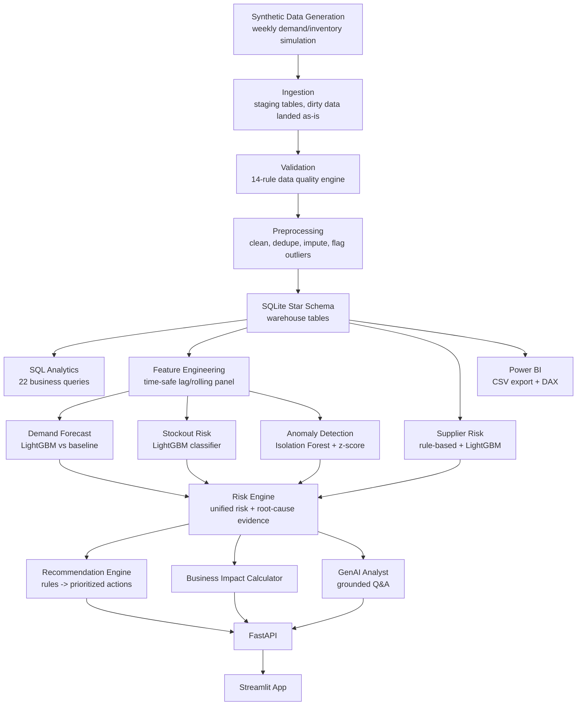

# Architecture

## Overview

SupplyIQ is a linear pipeline with a feedback-free, auditable flow: each
stage reads the previous stage's *trusted* output and writes its own
artifact, so any stage can be re-run independently once its inputs exist.

## Why SQLite by default (not Postgres)

This is a portfolio project meant to run on a bare Windows machine in
minutes with nothing to install beyond Python. SQLite gives:
- Zero server setup, zero connection strings, zero "it works on my machine"
  friction for a recruiter/interviewer trying it themselves.
- A real `.db` file that's still inspectable with any SQL client.
- Identical SQL dialect for ~95% of the analytics queries (the differences
  are documented in `database/schema/schema_postgres.sql`'s header comment).

The tradeoff: SQLite doesn't support true concurrent writers, has no native
`STDDEV()`/`PERCENTILE_CONT()` (worked around with `SQRT(AVG(x²)-AVG(x)²)`
and `NTILE()` respectively in the SQL layer), and isn't a realistic
choice for a production multi-user system. A documented, ready-to-use
Postgres schema is provided for exactly that reason — swap it in by
pointing `src/ingestion/load_raw.py`'s connection at a SQLAlchemy Postgres
engine instead of `sqlite3.connect()`.

## Why a linear pipeline instead of an orchestrator (Airflow/Prefect/Dagster)

For a project of this scale (one developer, on-demand runs, ~2 minute total
runtime), a DAG orchestrator would add operational surface area without
adding value. `scripts/run_pipeline.py` *is* the DAG — it's just expressed
as a Python list of steps with explicit ordering, executed sequentially,
with the same "stop immediately and show which step failed" behavior a real
orchestrator gives you. See `docs/future improvements` in the README for
when this would change (scheduled retraining at a real company).

## Data flow: staging vs. warehouse

`fact_orders` uniquely has a staging step (`staging_fact_orders_raw`, all
TEXT columns) because it's the only table with deliberately injected
data-quality issues. Every other table is already clean at generation time
and loads directly into its final warehouse table. This mirrors how a real
ELT pipeline handles messy operational data (orders) differently from
clean reference/master data (dimensions) — see `docs/business_logic.md`.

## What is NOT automated (and why)

| Component | Status | Reason |
|---|---|---|
| Power BI `.pbix` file | Manual, guided | Power BI Desktop is Windows-only and `.pbix` is a closed binary format; can't be generated by a script. `docs/powerbi.md` gives an exact, tested recipe using the pre-exported CSVs. |
| Docker build/run verification | Written, not executed | The build sandbox used to develop this project had no Docker daemon. Dockerfile and compose file are reviewed for correctness but should be validated on your machine — see README Limitations. |
| Live Postgres deployment | Schema provided, not wired up | Kept SQLite as the default for zero-friction setup; Postgres schema is a documented drop-in alternative, not exercised end-to-end here. |
| LLM-backed GenAI answers | Code implemented, not exercised with a live key | The build environment had no LLM API key configured; the local-fallback mode was used for all testing shown in this repo. |

## Component responsibilities

- **config/config.py** — single source of truth for paths, seeds, business
  constants, and thresholds. Nothing else hardcodes a magic number that
  appears here.
- **src/data_generation/** — the "digital twin" of a fictional company;
  produces `data/synthetic/*.csv`.
- **src/ingestion/** → **src/validation/** → **src/preprocessing/** — the
  ELT trust pipeline described above.
- **src/features/** — the ONLY place lag/rolling features are computed, so
  forecasting and stockout-risk models share one leak-free feature
  definition instead of each reimplementing it slightly differently.
- **src/models/**, **src/forecasting/**, **src/anomaly_detection/** — model
  training + evaluation + model-card generation.
- **src/risk_engine/** — combines model outputs into one view and computes
  root-cause evidence directly from the data (never templated).
- **src/recommendations/** — pure rules on top of risk engine output.
- **src/llm/** — grounded retrieval + optional LLM synthesis + local
  fallback.
- **src/api/**, **app/** — presentation layers over the same
  `data/processed/*.json` / SQLite artifacts; neither computes anything
  itself.
